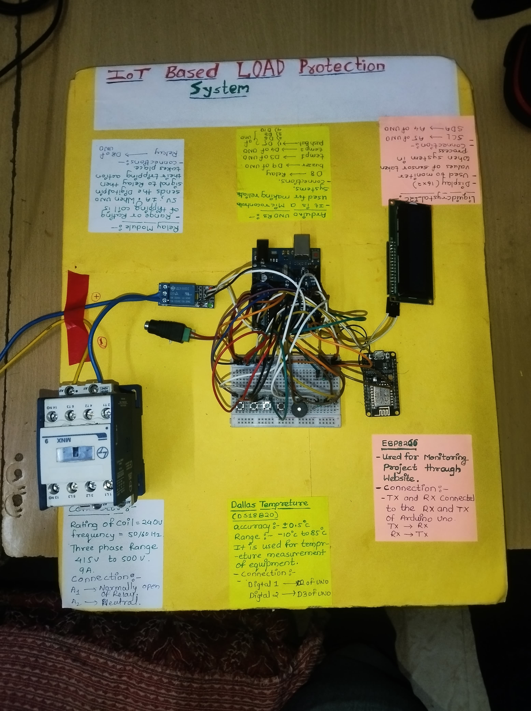

# IoT-Based Motor Monitoring & Protection System

## Description
This project is an IoT-based system designed for the real-time monitoring and **active protection** of an induction motor. It uses an Arduino to gather data from multiple sensors and an ESP8266 to serve a web-based dashboard for remote monitoring.

The system continuously tracks critical operational parameters including voltage, current, motor temperature, surrounding temperature, and RPM. If any parameter goes beyond the pre-defined safe operational limits, the system automatically triggers a relay to stop the motor, sounds a buzzer, and updates the motor's status on the web interface, preventing potential damage.

## Key Features
* **Real-Time Monitoring:** Continuously tracks motor voltage, current, RPM, and dual temperatures (motor casing and ambient).
* **Active Protection Logic:** Automatically stops the motor under the following fault conditions:
    * Over-Current
    * Over-Voltage
    * Under-Voltage
    * Over-Temperature (calculated against ambient temperature)
* **Web Dashboard:** An ESP8266 hosts a local Wi-Fi access point and a web server, allowing users to monitor the motor's status and sensor readings from any web browser on the network.
* **Visual and Audible Alerts:** A 16x2 LCD provides on-site data display, and a buzzer provides an audible alarm during a fault condition.
* **Data Communication:** The Arduino processes sensor data and sends it to the ESP8266 via serial communication for web display.

## Technologies Used

### Hardware
* **Main Controller:** Arduino (handles sensor reading and protection logic)
* **Web Server/Wi-Fi:** ESP8266 (creates access point and serves the web page)
* **Sensors:**
    * DS18B20 Temperature Sensors (for motor and ambient temperature)
    * Current Sensor (connected to A1)
    * Voltage Sensor (connected to A0)
    * IR Sensor (for RPM calculation)
* **Actuators & Display:**
    * 5V Relay Module (to start/stop the motor)
    * Buzzer (for alerts)
    * 16x2 I2C Liquid Crystal Display

### Software
* **Platform:** Arduino IDE
* **Languages:** C++ (for Arduino and ESP8266)
* **Key Libraries:** `DallasTemperature`, `LiquidCrystal_I2C`, `ESP8266WiFi`, `ESP8266WebServer`

## System Architecture

1.  **Sensing (Arduino):** The Arduino is the master controller, reading data from the temperature, current, voltage, and IR sensors.
2.  **Protection Logic (Arduino):** The `checkhealth()` function continuously compares sensor readings against safety thresholds. If a fault is detected, it stops the motor via the relay, sounds the buzzer, and updates the motor's state variable.
3.  **Communication (Serial):** The Arduino formats all sensor data and the motor's current state into a comma-separated string and sends it to the ESP8266 over the serial port.
4.  **Web Hosting (ESP8266):** The ESP8266 creates its own Wi-Fi access point. It receives the serial data from the Arduino, parses it, and uses it to populate an HTML web page.
5.  **Monitoring (User):** The user connects to the ESP8266's Wi-Fi network and navigates to its IP address to view the live data on a self-refreshing web page.

## Hardware Setup

**(Upload your `HARDWARE.jpg` image here)**

